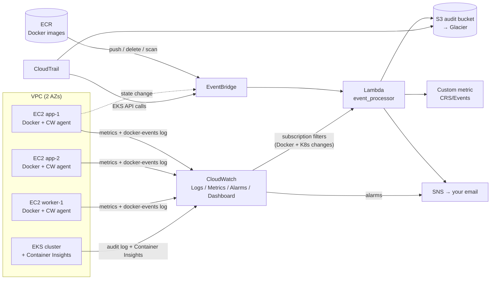

# Code Rendering Studio — AWS Multi-Server Monitoring with Terraform

Infrastructure-as-Code that builds **multiple Docker servers (EC2)**, a **Kubernetes cluster (EKS)**, a **Docker image registry (ECR)** and a complete **CloudWatch monitoring layer** that records every Docker and Kubernetes **create / update / delete** — plus **Lambda** and **S3** for automation and permanent audit history, and an optional **portfolio website on your own domain**.

> **A note on "ECL files":** Terraform files are written in **HCL** (HashiCorp Configuration Language) and end in `.tf`. Every `.tf` file in this folder *is* your IaC.

---

## 1. Architecture



### What watches what

| You want to know… | Where it's captured | How you see it |
|---|---|---|
| Server CPU / status | EC2 built-in metrics | Dashboard + alarm (auto-recover on hardware failure) |
| Server memory / disk | CloudWatch **agent** (installed by `user_data`) | Dashboard + alarms |
| Docker **container** created / started / updated / died / destroyed | `docker events` → `/var/log/docker-events.log` → CloudWatch Logs | Metric filters → `CRS/Docker` metrics, dashboard table, crash-loop alarm |
| Docker **image** pulled / tagged / deleted on a server | same Docker event stream | same |
| Docker **image** pushed (create/update) or deleted in the registry | ECR → EventBridge | Lambda → S3 record, `CRS/Events` metric, email on delete |
| Image has critical vulnerabilities | ECR scan-on-push → EventBridge | Lambda → email |
| K8s Deployment / Service / Pod **created / updated / deleted** | EKS **audit log** → CloudWatch Logs | Metric filters → `CRS/Kubernetes`, "who changed what" table, alarm on Deployment delete |
| K8s node / pod CPU, memory, restarts | **Container Insights** add-on | Dashboard + failed-node alarm |
| EKS cluster / node-group changes | CloudTrail → EventBridge | Lambda → S3 + metric |

---

## 2. Where Lambda and S3 fit in

**CloudWatch** is the *real-time* layer: live metrics, alarms, logs kept for `log_retention_days` (30 by default).

**Lambda** (`lambda/event_processor/main.py`) is the *reaction* layer — code that runs only when an event arrives, so it costs almost nothing. It:
1. Receives events from **EventBridge** (ECR push/delete/scan, EC2 state changes, EKS API calls) **and** from **CloudWatch Logs subscription filters** (Docker changes on the servers, human changes in Kubernetes).
2. Normalises them into one record: `source, action, target, actor, details`.
3. Writes the record to **S3**.
4. Publishes a custom metric `CRS/Events › ChangeEvents {Source, Action}` so ECR/EKS/EC2 changes appear on the same dashboard.
5. Sends an **email** (via SNS) for important actions — deletes, terminations, critical CVEs. Edit the `NOTIFY_ON` env var to change which.

Other common Lambda jobs you can add later: auto-tagging new resources, stopping dev servers at night, Slack/Teams notifications, auto-rollback.

**S3** is the *memory* layer:
- `changes/source=…/year=…/month=…/day=…/*.json` — permanent history written by Lambda (partitioned so **Athena** can query it with SQL: *"show every deployment deleted in March"*).
- `cloudtrail/` — every AWS API call.
- Versioning + encryption on; objects move to **Glacier** after `audit_archive_days`.
- A second S3 bucket hosts your **website** (section 6).
- Recommended: a third bucket holds your **Terraform state** (Step 0).

---

## 3. File-by-file guide

| File | What it does |
|---|---|
| `versions.tf` | Terraform + AWS provider versions, default tags, optional S3 remote-state backend, us-east-1 alias for CloudFront certs |
| `variables.tf` | Every setting (region, server list, thresholds, EKS on/off, domain) with descriptions |
| `terraform.tfvars.example` | Copy to `terraform.tfvars` and fill in |
| `network.tf` | VPC, public/private subnets in 2 AZs, NAT gateway, security group for the servers |
| `ec2.tf` | IAM role (CloudWatch agent + SSM + ECR pull), CloudWatch agent config in SSM Parameter Store, the servers (`for_each` over `var.instances`) |
| `templates/user_data.sh.tpl` | Boot script: installs Docker, the Docker-event logger service, the CloudWatch agent, runs a demo nginx container |
| `ecr.tf` | Image repositories with scan-on-push and lifecycle cleanup |
| `eks.tf` | EKS cluster (official module), audit logs on, Container Insights add-on, managed node group |
| `cloudwatch.tf` | SNS email, EC2 alarms, Docker + K8s metric filters, change alarms, the dashboard |
| `lambda.tf` | Lambda function, least-privilege IAM, error alarm, CloudWatch Logs → Lambda subscriptions |
| `eventbridge.tf` | Rules for ECR, EC2, EKS events → Lambda |
| `s3.tf` | Audit bucket (encrypted, versioned, lifecycle, TLS-only) + CloudTrail |
| `website.tf` | S3 + CloudFront + ACM certificate + Route 53 for your domain |
| `outputs.tf` | IPs, ECR URLs, kubectl command, dashboard link, nameservers |
| `k8s/sample-app.yaml` | Test Deployment + Service to trigger K8s events |
| `site/` | Starter portfolio page — edit freely |

### Key design choices explained
- **`for_each` on servers** — add `"app-3" = {...}` to `instances` and `terraform apply` creates just that server plus its 4 alarms and dashboard lines. Remove it and all of those go away.
- **No SSH keys by default** — connect with `aws ssm start-session --target <id>` (IAM-controlled, audited, no open port 22).
- **IMDSv2 required, encrypted disks, private EKS nodes, private S3** — sensible security defaults.
- **Audit filter excludes `system:*` users** for the Lambda feed, so you get human/CI changes, not the thousands of controller updates per hour. The metric filters count all successful changes (including rollouts done by controllers).
- **CloudWatch agent config in SSM** — change it once and re-run `amazon-cloudwatch-agent-ctl -a fetch-config` on the servers (or via SSM Run Command) without rebuilding them.

---

## 4. Deploy it

### Prerequisites
- AWS account + IAM user/role with admin rights (for the first build)
- [Terraform ≥ 1.6](https://developer.hashicorp.com/terraform/install), [AWS CLI v2](https://docs.aws.amazon.com/cli/latest/userguide/getting-started-install.html), `kubectl`, Docker
- `aws configure` done (or `AWS_PROFILE` set)

### Step 0 — remote state (recommended, one-time)
```bash
ACCOUNT=$(aws sts get-caller-identity --query Account --output text)
aws s3api create-bucket --bucket crs-terraform-state-$ACCOUNT --region us-east-1
aws s3api put-bucket-versioning --bucket crs-terraform-state-$ACCOUNT --versioning-configuration Status=Enabled
aws dynamodb create-table --table-name crs-terraform-locks \
  --attribute-definitions AttributeName=LockID,AttributeType=S \
  --key-schema AttributeName=LockID,KeyType=HASH --billing-mode PAY_PER_REQUEST
```
Then uncomment the `backend "s3"` block in `versions.tf` and put your account ID in the bucket name.

### Step 1 — configure
```bash
cp terraform.tfvars.example terraform.tfvars
# edit alert_email, instances, enable_eks, domain_name ...
```

### Step 2 — build
```bash
terraform init
terraform fmt -recursive
terraform validate
terraform plan -out tfplan
terraform apply tfplan          # EKS takes ~15 min
```
**Confirm the SNS subscription email** AWS sends you, or you won't get alerts.

### Step 3 — connect
```bash
terraform output                                   # IPs, URLs, commands
$(terraform output -raw eks_kubeconfig_command)    # kubectl access
kubectl get nodes
```
Open `cloudwatch_dashboard_url` from the outputs.

---

## 5. Test the monitoring (see events appear)

**Docker on EC2**
```bash
aws ssm start-session --target <instance-id>
sudo docker run -d --name test nginx      # ContainerCreated, ContainerStarted, ImagePulled
sudo docker update --cpus 0.5 test        # ContainerUpdated
sudo docker rm -f test                    # ContainerDied, ContainerDestroyed  (+ email)
sudo docker rmi nginx                     # ImageDeleted
```

**Docker images in ECR**
```bash
$(terraform output -raw ecr_login_command)
REPO=$(terraform output -json ecr_repositories | jq -r .web)
docker build -t $REPO:v1 . && docker push $REPO:v1              # ecr/push + scan result
aws ecr batch-delete-image --repository-name crs/web --image-ids imageTag=v1   # ecr/delete + email
```

**Kubernetes**
```bash
kubectl apply -f k8s/sample-app.yaml                          # DeploymentCreated, ServiceCreated
kubectl set image deploy/web web=public.ecr.aws/nginx/nginx:mainline   # DeploymentUpdated
kubectl delete -f k8s/sample-app.yaml                         # DeploymentDeleted → alarm + email
```

Metrics show up within ~1–5 minutes. Check:
- Dashboard `crs-dev-overview`
- `aws s3 ls s3://$(terraform output -raw audit_bucket)/changes/ --recursive`
- Lambda logs: `/aws/lambda/crs-dev-event-processor`

**Handy Logs Insights query** (EKS audit log group):
```
fields @timestamp, user.username, verb, objectRef.resource, objectRef.namespace, objectRef.name
| filter verb in ["create","update","patch","delete"] and not ispresent(objectRef.subresource)
| sort @timestamp desc | limit 100
```

---

## 6. Link your project to your domain (Code Rendering Studio)

The stack can host a portfolio at `https://yourdomain.com` and `https://www.yourdomain.com`.

1. **Edit the site** in `site/` (the starter page already has a card for this project — add a dashboard screenshot and your Fiverr profile link).
2. In `terraform.tfvars`: `enable_website = true`, `domain_name = "<your real domain>"`.
3. **If your domain is registered outside AWS** (GoDaddy, Namecheap, Hostinger…), keep `create_route53_zone = true` and do it in two passes so the certificate can validate:
   ```bash
   terraform apply -target=aws_route53_zone.site
   terraform output website_nameservers
   ```
   At your registrar, replace the domain's nameservers with those 4 values. Propagation is usually minutes to a few hours; check with `dig NS yourdomain.com +short`.
   ```bash
   terraform apply        # now issues the HTTPS cert, CloudFront, DNS records, uploads site/
   ```
   *Already use your registrar's DNS for email etc.?* Either copy those MX/TXT records into Route 53 before switching, or skip the Route 53 zone and create the ACM validation CNAMEs and a CNAME `www → <cloudfront domain>` at your registrar manually.
4. **If the domain is already in Route 53**, set `create_route53_zone = false` and just apply.
5. **Updating the site later:** edit files in `site/` → `terraform apply` → then clear the CDN cache:
   ```bash
   aws cloudfront create-invalidation --distribution-id $(terraform output -raw cloudfront_distribution_id) --paths "/*"
   ```

**Connecting it with Fiverr:** Fiverr doesn't host custom domains, so the link goes the other way — your domain is the portfolio, and Fiverr points buyers to it through the places Fiverr allows (portfolio section / project showcase, profile). Fiverr restricts external links and off-platform contact in some places, so check its current Terms of Service before adding URLs to gig descriptions or messages. On your site, link back to your Fiverr profile (the "Hire me on Fiverr" button — replace `YOUR_USERNAME`).

**Good portfolio content from this project:** a dashboard screenshot, the architecture diagram above, a 3-line problem → solution → result summary, and a link to the GitHub repo (never commit `terraform.tfvars` or state files — `.gitignore` already excludes them).

---

## 7. Cost (approximate, us-east-1, on-demand — check the AWS Pricing Calculator)

| Item | Rough monthly |
|---|---|
| EKS control plane | ~$73 |
| 2× t3.medium EKS nodes | ~$60 |
| 3× t3.small Docker servers | ~$45 |
| NAT gateway (single) | ~$33 + data |
| CloudWatch (custom metrics, logs, alarms, dashboard) | ~$10–30 depending on log volume |
| Lambda, S3, SNS, EventBridge, CloudTrail (1st trail) | usually < $2 |
| Website (S3 + CloudFront + Route 53 zone) | ~$1–2 |

Save money while learning: `enable_eks = false`, fewer/smaller servers, and **`terraform destroy`** when you're done for the day.

---

## 8. Clean up
```bash
kubectl delete -f k8s/sample-app.yaml   # remove LoadBalancers created by K8s first
terraform destroy
```

## 9. Next steps
- CI/CD: GitHub Actions that runs `terraform plan` on PRs and pushes images to ECR on merge.
- Athena table over `s3://<audit-bucket>/changes/` for SQL reporting.
- Slack notifications (SNS → AWS Chatbot).
- Split into modules (`modules/ec2-fleet`, `modules/monitoring`) once you have multiple environments.
